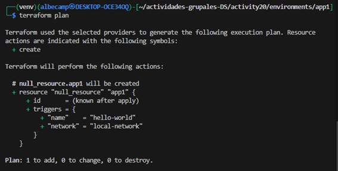
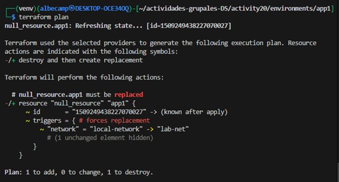
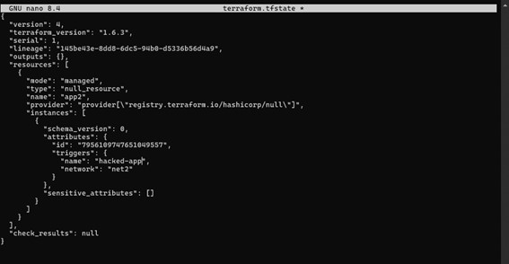
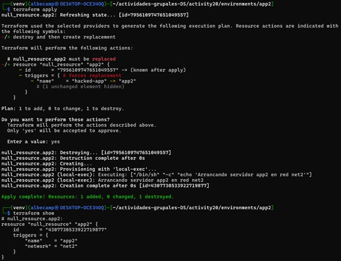
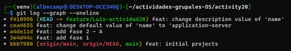
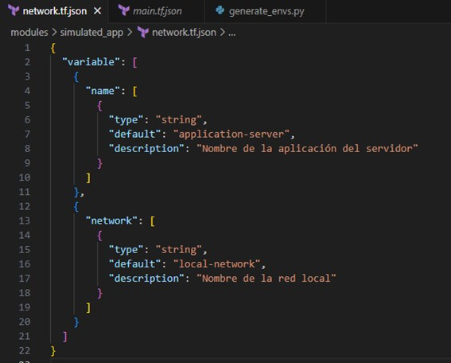
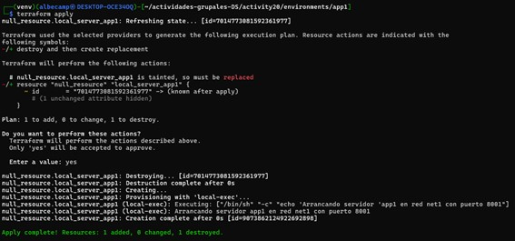
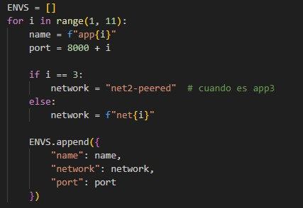
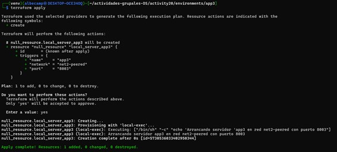

# ACTIVIDAD 20

## Fase 1

Cuando cambiamos variables (en este caso el nombre de una red) en terraform, este usa dicha información para saber si algo de la infraestructura debe actualizarse.
Esto es gracias a los *triggers*, que funcionan como señales que avisan a Terraform  que algo cambió.
Aplicando lo que nos piden:
1. Ejecutamos `python generate_envs.py`.
2. Nos dirigimos a `environments/app1` para ejecutar:
```
terraform init
terraform plan
terraform apply
```

<div align = "center">
    
</div>

3. Ahora, procedemos a cambiar el valor *default* de `network` de `modules/simulated_app/network.tf.json`, pasando de `local-network` a `lab-net`.
4. Ejecutamos nuevamente `python generate_envs.py` y nos dirigimos a `environments/app1`.
5. Al ejecutar `terraform plan`, nos fijamos que terraform nos avisa que el trigger ha cambiado:
```
"network" = "local-network" -> "lab-net"
```
Esto indica que solamente detectó el cambio de nombre de la red y no de todo el recurso.

<div align = "center">
    
</div>

### Preguntas

- **¿Cómo interpreta Terraform el cambio de variable?**
Terraform compara los valores actuales del estado (`terraform.tfstate`) con los nuevos valores puestos en los archivos modificados (`.tf.json`).
Si se modifica una variable que afecta un atributo que está siendo usado como *trigger*, entonces se detecta el cambio de dicho *trigger* y lo marca como actualizado.
- **¿Qué diferencia hay entre modificar el JSON vs. parchear directamente el recurso?**
Si modificamos la variable en `network.tf.json` y volvemos a generar los entornos entonces tenemos la opción de mantener una configuración más limpia y automática.
Si modificamos directamente el recurso también va a funcionar, pero perdemos esa automatización además de que si volvemos a ejecutar el script se sobreescribirá el cambio que hicimos.
- **¿Por qué Terraform no recrea todo el recurso, sino que aplica el cambio "in-place"?**
Terraform detecta que solamente se modificó el *trigger*. Al trabajar de manera local, usando `null_resource`, son los *triggers* los que definen si se crea o no el recurso. Al ver la 2da imagen, vemos el símbolo `~`, lo cual indica que se pueden reemplazar dichos valores.
- **¿Qué pasa si editas directamente `main.tf.json` en lugar de la plantilla de variables?**
Va a funcionar, el cambio que hagamos se mostrará al ejecutar `terraform plan`, pero se perderá esa característica de automatización, además de que si volvemos a ejecutar el script entonces se sobrescribirá el cambio manual que hayamos hecho.

## Fase 2
### A. Remediación de 'drift'
Cuando cambiamos variables (en este caso cambiando el nombre de la red) en Terraform, este se guia de dicha información para saber si algo debe modificarse.
Para esta fase, vamos a simular un *drift*, esto pasa cuando ocurre una modificación que está fuera del control de Terraform. Al trabajar de manera local, esto se logra modificando el estado actual (`terraform.tfstate`).
Realizando el problema:
1. Ejecutamos `python generate_envs.py` para crear los entornos.
2. Nos vamos a `environments/app2` y aplicamos los comandos:
```
terraform init
terraform plan
terraform apply
```
3. Luego de `apply`, en el `terraform.tfstate` encontramos `"name": "app2"` que coincide con lo que indica en el archivo `main.tf.json` de `app2`
4. Como trabajamos de manera local, para simular un cambio fuera de Terraform, modificamos manualmente `terraform.tfstate`, cambiando a `"name": "hacked-app"`.

<div align = "center">
    
</div>

5. Ahora, al ejecutar `terraform plan`, Terraform comparará la estructura de `main.tf.json` con el de `terraform.tfstate`.
6. Terraform detecta la diferencia entre ambos archivos y muestra `"name" = "hacked-app" -> "app2"`, o sea, indicando un drift.

<div align = "center">
    
</div>

## Fase 3

### Control de versiones comunica contexto

Se aplican commits siguiendo las buenas prácticas, agregando mensajes claros indicando qué cosa fue modificado y por qué. En este caso modificamos como ejemplo se cambia el valor por defecto y la descripción de `name`.

<div align = "center">
    
</div>

### Linting y formateo

Formateamos el archivo `network.tf.json` con la herramienta jq, ayudándonos a visualizar el contenido de dicho archivo en una forma más legible.

<div align = "center">
    
</div>

### Nomenclatura de recursos

Se mejora el nombre del recurso para que sea más adecuado y para una mejor indicación:
- Se cambia `hello-server` por `local-server`.
- Se modifica en el scrip, cambiando de `env['name']` a `f"local_server_{env['name']}"`

### Variables y constantes

Se añade la variable `port` en `network.tf.json` y se añade en la parte de *trigger* para que cada entorno al momento de crearse se le asigne un puerto.

<div align = "center">
    
</div>

### Parametrizar dependencias

Se añade condicionales al momento de crearse los entornos, para que cuando se cree `app3` se le asigne como valor de network uno especial, simulando que su network depende de `app2`

<div align = "center">
    
</div>

<div align = "center">
    
</div>

## Fase 4
- **¿Cómo extenderías este patrón para 50 módulos y 100 entornos?**
Al escalar es importante separar la lógica de la creación del contenido de cada entorno. Para esos casos podemos definir los entornos en un archivo `configs.json`, que contenga parámetros como name, port y network. Luego, con el script `.py` recorreriamos dicha lista para crear carpetas con su propia configuración. Ahora, para 50 módulos, podemos organizar la carpeta `modules` por el tipo de aplicación o servicio.
-   **¿Qué prácticas de revisión de código aplicarías a los `.tf.json`?**
Primero, podriamos aplicar validaciones con herramientas como `jq`. Otra opción sería agregar hooks de pre-commits que verifiquen cambios no esperados. También sería bueno el uso de pull requests donde se explique los cambios hechos. Ahora, hablamos de automatización, es bueno mantener las variables parametrizadas fuera del recurso.
-   **¿Cómo gestionarías secretos en producción (sin Vault)?**
Podemos usar variables de entorno con Python para leer por ejemplo `api_key` en lugar de hardcodearlos. Al momento de generar el `main.tf.json` se marca la variable `sensitive` como `true`, evitando escribir su valor en el disco. Una alternativa sería usar un archivo `terraform.tfvars.json` que no esté incluido en el `.gitignore` y que contenga claves cifradas por el CI/CD.
-   **¿Qué workflows de revisión aplicarías a los JSON generados?**
Podríamos usar flujo de CI que contengan validaciones automáticas, como por ejemplo ejecutar `terraform init`, `plan` y `validate` en cada pullrequest. También agregar un formateo con `jq`. Otra opción es revisar los PRs generados visualmente con herramientas que pasen de JSON a HCL, o que simplemente generen un resumen del plan. También registrar cambios importantes o sensibles con git u otro controlador de versiones, por ejemplo un commit que solo indique el cambio de description, u otro que cambie default.
